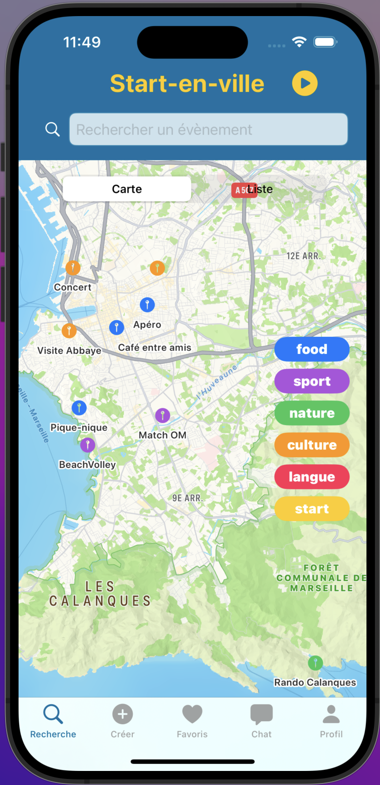
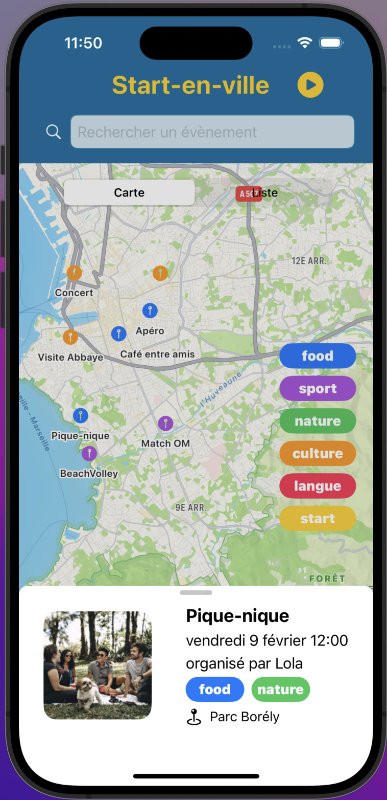
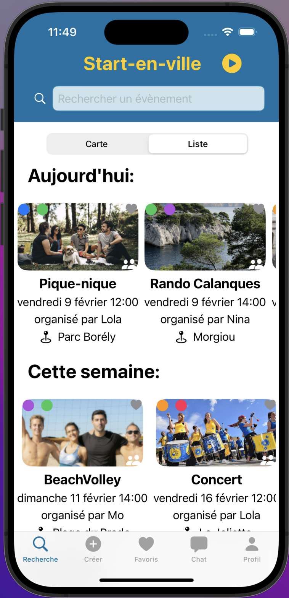
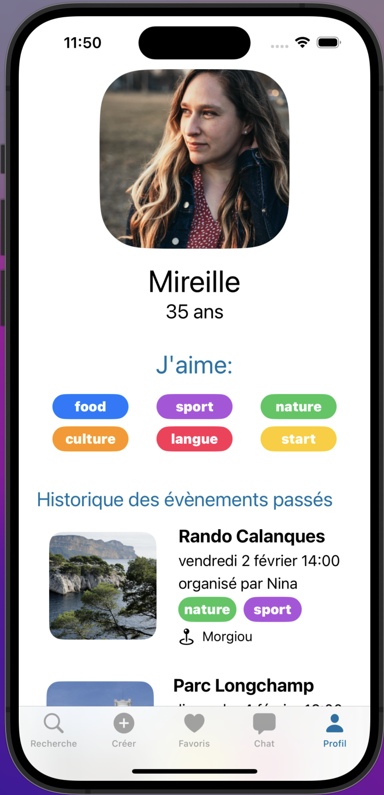
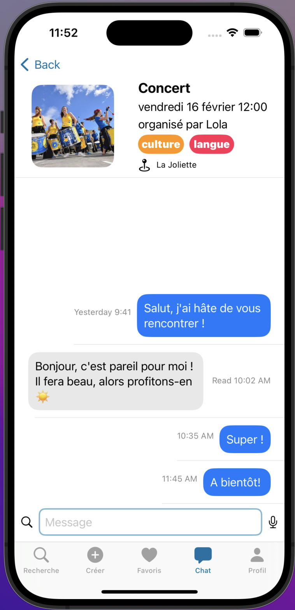
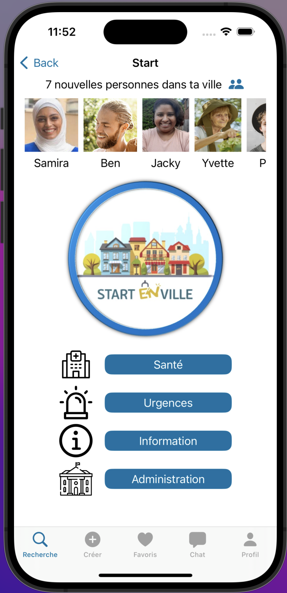

<h1 align="center"> StartEnVille </h1>

StartEnVille is an application developed as part of the Apple Foundation Program. Its purpose is to assist newcomers in a city to overcome loneliness, meet new people, and engage in activities tailored to their interests while exploring the city.

## Features

### 1. Activity Search on City Map: 
Users can explore activities on a city map with color-coded markers based on their interests.
  
### 2. Chronological Activity Calendar: 
View activities organized chronologically, including today's, this weekend's, and this month's events.

### 3. Event Details: 
Access detailed information about an event, including organizer details and participants.

### 4. Favorite Events: 
Users can mark events as favorites to indicate their interest and participation.

### 5. Event Chat: 
Each event has its chat feature to facilitate organization and communication among participants.

### 6. User Profile: 
Users can set their interests, view past event history, and list upcoming events.

### 7. Create Activity: 
Users can create activities that will be displayed on the map and calendar.

## Demo Video and Screenshots

To get started with StartEnVille:

<h3>1. Demo video</h3>
Check out the demo video to see StartEnVille in action : https://youtu.be/RSKXEH4LgSQ

<h3>2. Screenshots</h3>

     

<h3>Contributing</h3>
We welcome contributions from the community. If you have suggestions for features or find any issues, please open an issue or submit a pull request.

<h3>Credits</h3>
This project was developed by Les Connecteuz as part of the Apple Foundation Program.
